# pynari on Windows with all local ANARI devices

This page describes how pynari (branch `mjar/devel`: `jar091/devel` merged with the upstream
`master`, pynari 1.4.2) is built on Windows against a local ANARI SDK 0.17. It also covers
how all pynari samples are run against every ANARI device built in the same workspace, and
what the results are:

| Configuration | ANARI library | Notes |
|---|---|---|
| `helide` | helide | ANARI SDK reference device (CPU) |
| `visrtx` | visrtx | NVIDIA VisRTX, RTX device, `default` (= `interactive`) renderer |
| `barney` | barney | barney (CUDA/OptiX) |
| `cycles_optix` | cycles | cyclesphi-anari (Blender Cycles as an ANARI device) on OptiX |
| `cycles_cpu` | cycles | cyclesphi-anari on the CPU |
| `mitsuba_cuda` | mitsuba | mitsuba-anari, variant `cuda_ad_rgb` |
| `mitsuba_llvm` | mitsuba | mitsuba-anari, variant `llvm_ad_rgb` (CPU) |
| `moonray` | moonray | openmoonray-anari, MoonRay (CPU) |
| `visionaray` | visionaray | anari-visionaray on the CPU |
| `visionaray_cuda` | visionaray_cuda | anari-visionaray on CUDA |
| `ospray` | ospray | anari-ospray, Intel OSPRay 3.2 (CPU), `default` (= `pathtracer`) renderer |
| `rpr` | rpr | RadeonProRenderANARI, Radeon ProRender 3.1.7 Northstar on the GPU (CUDA) |
| `photon` | photon | Photon (Kokkos) on the GPU: Kokkos Cuda with OptiX |
| `photon_cpu` | photon | Photon on the CPU: Kokkos Threads with Embree |

How the devices themselves are built is described in the Blender ANARI documentation
(`blenderphi/doc/anari/README.md`, section 4). Everything lives in `F:\work\anari`:
sources side by side, builds in `build\`, installs in `install\`.

Contents:

1. [Building pynari](#1-building-pynari)
2. [Running a sample](#2-running-a-sample)
3. [Running all samples with all devices](#3-running-all-samples-with-all-devices)
4. [Changes to pynari](#4-changes-to-pynari)
5. [Results](#5-results)
6. [Remaining differences](#6-remaining-differences)
7. [Device bugs found with the samples](#7-device-bugs-found-with-the-samples)

## 1. Building pynari

Requirements:
* Visual Studio 2022
* CMake ≥ 3.28
* CUDA 12.8 (optional: for `has_cuda_capable_gpu()` and `readGPU`)
* Python 3.13
* ANARI SDK 0.17 installed in `F:\work\anari\install`

```bat
git clone -b jar091/devel https://github.com/jar091/pynari F:\work\anari\pynari
rem branch mjar/devel: the upstream master merged in, see section 4 (the merge is not committed)
git -C F:\work\anari\pynari checkout -b mjar/devel
git -C F:\work\anari\pynari merge --no-commit --no-ff origin/master

rem Python environment with the build and sample dependencies
D:\apps\Python313\python.exe -m venv F:\work\anari\build\pynari-venv
F:\work\anari\build\pynari-venv\Scripts\python.exe -m pip install numpy pybind11 pillow matplotlib mpi4py
```

`mpi4py` is only used by `sample06`, and it uses the MS-MPI runtime installed on the
machine.

Configure and build from a Visual Studio x64 developer prompt. Alternatively, run
[`tools/build_pynari.ps1`](tools/build_pynari.ps1), which enters the developer shell itself:

```bat
cmake -S F:/work/anari/pynari -B F:/work/anari/build/pynari -G "Visual Studio 17 2022" -A x64 ^
  -Danari_DIR=F:/work/anari/install/lib/cmake/anari-0.17.0 ^
  -DPYNARI_USE_INSTALLED_PYBIND=ON ^
  -Dpybind11_DIR=F:/work/anari/build/pynari-venv/Lib/site-packages/pybind11/share/cmake/pybind11 ^
  -DPython_EXECUTABLE=F:/work/anari/build/pynari-venv/Scripts/python.exe ^
  -DPYBIND11_FINDPYTHON=ON -DCMAKE_CUDA_ARCHITECTURES=native
cmake --build F:/work/anari/build/pynari --config Release --parallel
```

pybind11 3.1 from the venv is used (`PYNARI_USE_INSTALLED_PYBIND`), not the vendored copy.
The result is `F:\work\anari\build\pynari\Release\pynari.cp313-win_amd64.pyd`. It is used
directly from that directory, without installing a wheel.

## 2. Running a sample

All samples call `anari.newDevice('default')`, which loads the library named by the
`ANARI_LIBRARY` environment variable. Since Python 3.8, Windows ignores `PATH` for the
dependencies of extension modules, so the directories with the ANARI DLLs have to be
registered with `os.add_dll_directory()`. [`tools/_launch.py`](tools/_launch.py) does that
for the directories in `PYNARI_DLL_DIRS`, puts `PYNARI_MODULE_DIR` on `sys.path`, and runs
the sample:

```bat
set ANARI_LIBRARY=barney
set PYNARI_DLL_DIRS=F:\work\anari\install\bin
set PYNARI_MODULE_DIR=F:\work\anari\build\pynari\Release
set PATH=F:\work\anari\install\bin;%PATH%
F:\work\anari\build\pynari-venv\Scripts\python.exe tools\_launch.py F:\work\anari\pynari\samples\sample01.py -o sample01.png
```

Per device:

| Device | `ANARI_LIBRARY` | DLL directories | Device selection |
|---|---|---|---|
| helide, VisRTX, barney | `helide`, `visrtx`, `barney` | `install\bin` | |
| cyclesphi-anari | `cycles` | `install\bin` and `build\blender\bin\Release\blender.shared` (Blender's OpenImageIO, OpenVDB, TBB, ...) | `CYCLES_ANARI_USE_GPU=OPTIX` or `CUDA`, or `ANARI_CYCLES_FORCE_CPU=1` |
| mitsuba-anari | `mitsuba` | `install\mitsuba\bin`, `install\bin` | `ANARI_MITSUBA_VARIANT=cuda_ad_rgb`, `llvm_ad_rgb` or `scalar_rgb` |
| MoonRay | `moonray` | `install\moonray\bin`, `install\bin` | |
| anari-visionaray | `visionaray` (CPU), `visionaray_cuda` | `install\bin` | the library name selects the back-end |
| anari-ospray | `ospray` | `install\ospray\bin`, `install\bin` | |
| RadeonProRenderANARI | `rpr` | `install\rpr\bin`, `install\bin` | `ANARI_RPR_COMPUTE_DEVICE=gpu`, `cpu` or `gpu+cpu` |
| Photon | `photon` | `install\photon\bin` (GPU) or `install\photon_cpu\bin` (CPU), `install\bin` | the directory selects the build |

Device parameters can also be set from Python, which needs the change described in
[section 4](#4-changes-to-pynari):

```python
device = anari.newDevice('default')
device.setParameter('mitsuba.variant', anari.STRING, 'llvm_ad_rgb')
device.commitParameters()
```

Environment variables of pynari:

| Variable | Effect |
|---|---|
| `PYNARI_LOG_LEVEL=0..3` | Device messages printed to stderr: 0 errors only (default), 1 also warnings, 2 also performance warnings and info, 3 also debug. `PYNARI_DBG` is still accepted. |
| `PYNARI_RAISE_ON_ERROR=1` | `frame.render()` raises `RuntimeError` when the device reported an error while rendering |

## 3. Running all samples with all devices

[`tools/run_all.py`](tools/run_all.py) runs every script in `samples/`,
`samples/interactive/` and `testing/`, and the viewer examples. Each run happens in its
own process, with a timeout. The results go to `F:\work\anari\build\pynari-out`:
`<config>/<sample>.png`, `<config>/<sample>.log`, and the summary in `results.json` and
`results.md`. The script uses the workspace paths above (`ROOT` at the top of the file).

```bat
set PY=F:\work\anari\build\pynari-venv\Scripts\python.exe
%PY% tools\run_all.py                                   & rem everything
%PY% tools\run_all.py -r barney,cycles_optix -s sample0 & rem some devices and samples
%PY% tools\run_all.py -t 2400 -j 2                      & rem timeout [s], parallel jobs
%PY% tools\run_all.py -r rpr --results F:\work\anari\build\pynari-out\results-rpr.json
```

Without `-r`, every configuration whose device library is installed is run. Runs that
execute at the same time need different `--results` files; the tools below take several of
them.

The scripts that open a window are run headless:

* [`tools/viewer_headless.py`](tools/viewer_headless.py) builds the scenes of
  `viewer/examples` (`sample01`, `02`, `05`, `07`), renders one frame and reads it back
  with `frame.map`/`unmap`, as the viewer does.
* [`tools/interactive_headless.py`](tools/interactive_headless.py) drives
  `samples/interactive/bobblespheres3.py` for a few frames.
* `viewer/anari_viewer.py` (GLFW) and the `sample_volume_vdb`/`sample_volume_sitk`
  examples, which need pyopenvdb, SimpleITK and downloaded data, are not run.

The result images below were made with [`tools/pynari_montage.py`](tools/pynari_montage.py)
and the table with [`tools/pynari_table.py`](tools/pynari_table.py).
[`tools/white_furnace.py`](tools/white_furnace.py) is a small energy check: a matte sphere
with albedo 0.5, lit only by an ambient light of radiance 1, has to render 0.5.

## 4. Changes to pynari

These changes are in the working tree only and are not committed.

* **Merge with upstream `master`** (pynari 1.4.2, 9 commits). The branch is an uncommitted
  merge of `origin/master` into `jar091/devel`; the changes below were re-applied on top
  without conflicts. Upstream brought:
  * A reworked object lifetime: `object.release()` and the new `device.release()` release
    the ANARI handles, and the device stays alive until its last object is gone.
    `PYNARI_WARN_MISSING_RELEASES=1` reports objects that were left to the garbage
    collector.
  * `object.setAndReleaseParameter(name, type, object)`.
  * `sample06` now asks for the device subtype `mpi` and `geometry-cones-colorPerPrim`
    releases all its objects.
  * CMake ≥ 3.28 is required.
* **Logging** (`pynari/Context.cpp`). Release builds dropped every device warning.
  `PYNARI_LOG_LEVEL` now selects what is printed, and stderr is flushed after each message.
* **Error propagation** (`pynari/Context.cpp`, `Frame.cpp`, `bindings.cpp`, `common.h`).
  Device errors (for example "render failed") never reached Python. pynari now records
  them:
  * `anari.error_count()` returns the number of errors reported so far.
  * `anari.take_errors()` returns the recent error messages and clears them.
  * `anari.set_raise_on_error(True)` or `PYNARI_RAISE_ON_ERROR=1` makes `frame.render()`
    raise `RuntimeError` with the messages.

  Raising is off by default, because some test scripts render incomplete frames on purpose.
* **Device parameters** (`Context.h/.cpp`, `bindings.cpp`). `device.setParameter` only
  accepted integers. It now also takes `STRING` and `FLOAT32`, plus `BOOL` in the integer
  overload, with the integer overload registered first.
* **Booleans** (`Object.cpp`, `bindings.cpp`, `becomes.__init__.py`). Added `anari.BOOL`;
  object setters accept `ANARI_BOOL`.
* **Samples.**
  * `sample01.py` and `sample01_with_texture.py` now flip the image vertically when saving
    with `-o`, like all the other samples.
  * `interactive/bobblespheres3.py` has no lights and relied on a default ambient light.
    It now sets `ambientRadiance` explicitly, because the default is 0 in the ANARI
    specification (VisRTX, Mitsuba and MoonRay rendered it black).
* This documentation and the tools in `doc/windows/`.

## 5. Results

The final run was on 2026-10-06, on an RTX 2080 Ti and a 32-thread Xeon E5-2640 v3,
with pynari merged with the upstream `master` and all device fixes from
[section 7](#7-device-bugs-found-with-the-samples). Each cell shows whether the run passed
(the process exited normally and wrote its image) and its time. All 36 samples pass on all
14 configurations. The times include process start-up and scene setup, and they are only
a rough guide: the GPU configurations ran one after the other, the CPU configurations two
jobs in parallel, and other builds and tests were running on the machine. Only `photon`
and `photon_cpu` ran alone.

| sample | helide | visrtx | barney | cycles_optix | cycles_cpu | mitsuba_cuda | mitsuba_llvm | moonray | visionaray | visionaray_cuda | ospray | rpr | photon | photon_cpu |
|---|---|---|---|---|---|---|---|---|---|---|---|---|---|---|
| [camera-depth-of-field](images/camera-depth-of-field.png) | ok 2s | ok 5s | ok 4s | ok 4s | ok 6s | ok 6s | ok 7s | ok 26s | ok 14s | ok 12s | ok 8s | ok 10s | ok 4s | ok 13s |
| [geometry-cones](images/geometry-cones.png) | ok 2s | ok 3s | ok 4s | ok 3s | ok 5s | ok 3s | ok 3s | ok 19s | ok 6s | ok 3s | ok 3s | ok 6s | ok 2s | ok 5s |
| [geometry-cones-colorPerPrim](images/geometry-cones-colorPerPrim.png) | ok 2s | ok 4s | ok 5s | ok 3s | ok 6s | ok 3s | ok 3s | ok 15s | ok 4s | ok 3s | ok 5s | ok 6s | ok 2s | ok 4s |
| [geometry-cones-colorPerVertex](images/geometry-cones-colorPerVertex.png) | ok 2s | ok 4s | ok 5s | ok 3s | ok 4s | ok 3s | ok 5s | ok 13s | ok 9s | ok 3s | ok 4s | ok 6s | ok 2s | ok 4s |
| [geometry-cylinders](images/geometry-cylinders.png) | ok 1s | ok 3s | ok 4s | ok 3s | ok 4s | ok 3s | ok 4s | ok 6s | ok 6s | ok 3s | ok 4s | ok 6s | ok 2s | ok 4s |
| [geometry-cylinders-colorPerPrim](images/geometry-cylinders-colorPerPrim.png) | ok 1s | ok 3s | ok 4s | ok 3s | ok 4s | ok 3s | ok 4s | ok 8s | ok 6s | ok 3s | ok 5s | ok 6s | ok 2s | ok 3s |
| [geometry-cylinders-colorPerVertex](images/geometry-cylinders-colorPerVertex.png) | ok 1s | ok 3s | ok 4s | ok 3s | ok 4s | ok 3s | ok 3s | ok 6s | ok 5s | ok 3s | ok 4s | ok 6s | ok 2s | ok 3s |
| [geometry-spheres-with-sampler1D](images/geometry-spheres-with-sampler1D.png) | ok 2s | ok 20s | ok 5s | ok 6s | ok 52s | ok 5s | ok 38s | ok 91s | ok 108s | ok 23s | ok 45s | ok 127s | ok 6s | ok 66s |
| [geometry-triangles-testorb-np](images/geometry-triangles-testorb-np.png) | ok 2s | ok 7s | ok 6s | ok 5s | ok 39s | ok 4s | ok 13s | ok 323s | ok 66s | ok 14s | ok 30s | ok 11s | ok 4s | ok 29s |
| [interactive-bobblespheres3](images/interactive-bobblespheres3.png) | ok 3s | ok 5s | ok 5s | ok 5s | ok 8s | ok 5s | ok 13s | ok 17s | ok 13s | ok 5s | ok 7s | ok 40s | ok 4s | ok 11s |
| [reference-hdri](images/reference-hdri.png) | ok 1s | ok 4s | ok 4s | ok 4s | ok 11s | ok 3s | ok 8s | ok 26s | ok 28s | ok 4s | ok 12s | ok 7s | ok 2s | ok 10s |
| sample-getInfo | ok 1s | ok 2s | ok 2s | ok 2s | ok 3s | ok 2s | ok 5s | ok 7s | ok 4s | ok 2s | ok 2s | ok 2s | ok 1s | ok 1s |
| [sample01](images/sample01.png) | ok 1s | ok 3s | ok 4s | ok 4s | ok 6s | ok 3s | ok 6s | ok 30s | ok 13s | ok 4s | ok 6s | ok 8s | ok 2s | ok 11s |
| [sample01_with_texture](images/sample01_with_texture.png) | ok 1s | ok 3s | ok 4s | ok 3s | ok 7s | ok 3s | ok 6s | ok 32s | ok 11s | ok 3s | ok 6s | ok 7s | ok 2s | ok 10s |
| [sample02](images/sample02.png) | ok 2s | ok 4s | ok 5s | ok 4s | ok 13s | ok 5s | ok 6s | ok 34s | ok 23s | ok 7s | ok 9s | ok 10s | ok 3s | ok 13s |
| [sample03](images/sample03.png) | ok 1s | ok 6s | ok 8s | ok 9s | ok 46s | ok 85s | ok 309s | ok 718s | ok 98s | ok 9s | ok 217s | ok 44s | ok 17s | ok 249s |
| [sample03-isosurface](images/sample03-isosurface.png) | ok 1s | ok 14s | ok 11s | ok 4s | ok 12s | ok 4s | ok 21s | ok 90s | ok 123s | ok 4s | ok 59s | ok 32s | ok 5s | ok 72s |
| [sample04](images/sample04.png) | ok 2s | ok 4s | ok 6s | ok 4s | ok 24s | ok 4s | ok 16s | ok 28s | ok 37s | ok 9s | ok 17s | ok 20s | ok 8s | ok 15s |
| [sample04_pointLight](images/sample04_pointLight.png) | ok 3s | ok 4s | ok 5s | ok 4s | ok 21s | ok 4s | ok 14s | ok 27s | ok 36s | ok 9s | ok 10s | ok 33s | ok 8s | ok 15s |
| [sample05](images/sample05.png) | ok 2s | ok 4s | ok 5s | ok 4s | ok 10s | ok 5s | ok 14s | ok 49s | ok 19s | ok 6s | ok 17s | ok 32s | ok 3s | ok 17s |
| [sample06](images/sample06.png) | ok 1s | ok 2s | ok 3s | ok 3s | ok 5s | ok 3s | ok 6s | ok 27s | ok 10s | ok 3s | ok 6s | ok 27s | ok 2s | ok 5s |
| [sample07](images/sample07.png) | ok 2s | ok 4s | ok 9s | ok 4s | ok 24s | ok 5s | ok 19s | ok 58s | ok 35s | ok 10s | ok 32s | ok 24s | ok 4s | ok 36s |
| [sampler-image3d](images/sampler-image3d.png) | ok 2s | ok 5s | ok 8s | ok 4s | ok 15s | ok 2s | ok 18s | ok 282s | ok 50s | ok 4s | ok 38s | ok 66s | ok 4s | ok 62s |
| [sampler-image3d-borderColor](images/sampler-image3d-borderColor.png) | ok 1s | ok 5s | ok 8s | ok 4s | ok 17s | ok 2s | ok 20s | ok 210s | ok 60s | ok 4s | ok 40s | ok 44s | ok 4s | ok 62s |
| testing-release_00 | ok 1s | ok 1s | ok 17s | ok 1s | ok 2s | ok 1s | ok 3s | ok 3s | ok 13s | ok 2s | ok 6s | ok 3s | ok 0s | ok 1s |
| testing-release_01 | ok 1s | ok 2s | ok 2s | ok 2s | ok 3s | ok 0s | ok 4s | ok 5s | ok 1s | ok 1s | ok 1s | ok 9s | ok 1s | ok 1s |
| testing-release_02 | ok 1s | ok 2s | ok 2s | ok 2s | ok 2s | ok 0s | ok 3s | ok 3s | ok 2s | ok 1s | ok 2s | ok 2s | ok 0s | ok 1s |
| testing-release_03 | ok 1s | ok 2s | ok 2s | ok 2s | ok 3s | ok 1s | ok 3s | ok 2s | ok 2s | ok 1s | ok 2s | ok 11s | ok 0s | ok 0s |
| testing-release_04 | ok 1s | ok 2s | ok 2s | ok 2s | ok 2s | ok 1s | ok 3s | ok 2s | ok 1s | ok 1s | ok 2s | ok 3s | ok 1s | ok 0s |
| testing-release_05 | ok 1s | ok 2s | ok 2s | ok 2s | ok 1s | ok 1s | ok 4s | ok 2s | ok 1s | ok 1s | ok 2s | ok 14s | ok 1s | ok 0s |
| [unstructured-cellCentric](images/unstructured-cellCentric.png) | ok 1s | ok 2s | ok 5s | ok 8s | ok 44s | ok 4s | ok 26s | ok 20s | ok 44s | ok 17s | ok 10s | ok 18s | ok 2s | ok 7s |
| [unstructured-vertexCentric](images/unstructured-vertexCentric.png) | ok 1s | ok 2s | ok 5s | ok 8s | ok 44s | ok 5s | ok 25s | ok 12s | ok 35s | ok 17s | ok 12s | ok 16s | ok 2s | ok 7s |
| [viewer-sample01](images/viewer-sample01.png) | ok 1s | ok 2s | ok 3s | ok 2s | ok 2s | ok 2s | ok 3s | ok 3s | ok 1s | ok 1s | ok 2s | ok 15s | ok 1s | ok 1s |
| [viewer-sample02](images/viewer-sample02.png) | ok 1s | ok 2s | ok 3s | ok 2s | ok 2s | ok 4s | ok 4s | ok 13s | ok 3s | ok 2s | ok 3s | ok 21s | ok 2s | ok 1s |
| [viewer-sample05](images/viewer-sample05.png) | ok 1s | ok 2s | ok 2s | ok 2s | ok 3s | ok 3s | ok 6s | ok 3s | ok 4s | ok 1s | ok 3s | ok 7s | ok 1s | ok 1s |
| [viewer-sample07](images/viewer-sample07.png) | ok 1s | ok 2s | ok 3s | ok 2s | ok 2s | ok 4s | ok 4s | ok 3s | ok 4s | ok 1s | ok 2s | ok 8s | ok 1s | ok 1s |

504 of 504 runs passed.

### Images

Each image shows one sample. It has one tile per configuration, in the order of the table
above, with the status and time under each tile.

**camera-depth-of-field**

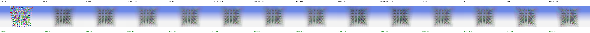

**geometry-cones**

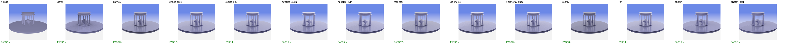

**geometry-cones-colorPerPrim**

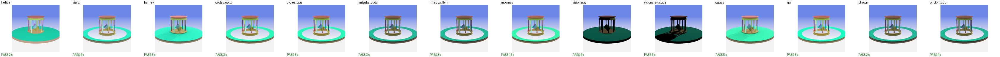

**geometry-cones-colorPerVertex**

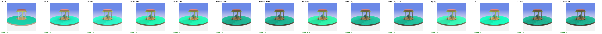

**geometry-cylinders**

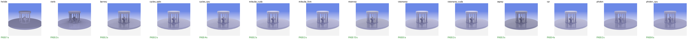

**geometry-cylinders-colorPerPrim**

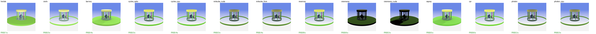

**geometry-cylinders-colorPerVertex**

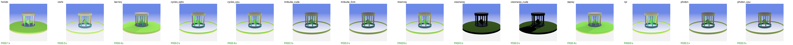

**geometry-spheres-with-sampler1D**

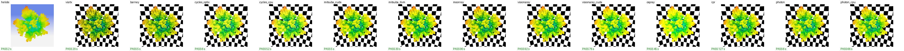

**geometry-triangles-testorb-np**

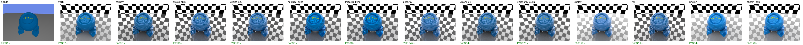

**interactive-bobblespheres3**

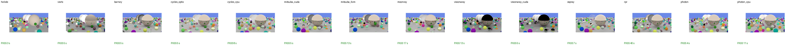

**reference-hdri**

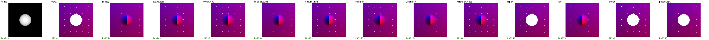

**sample01**

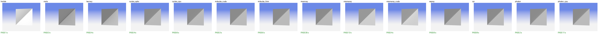

**sample01_with_texture**

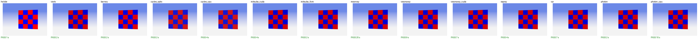

**sample02**

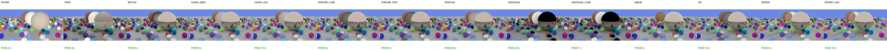

**sample03**

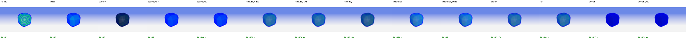

**sample03-isosurface**

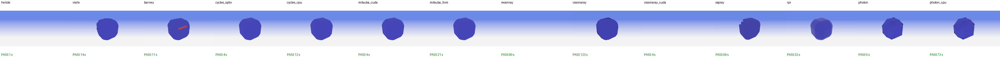

**sample04**

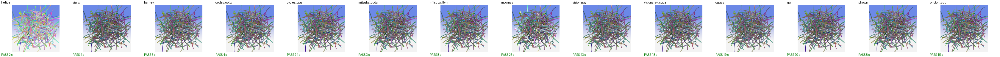

**sample04_pointLight**

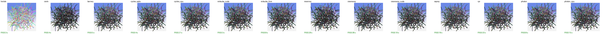

**sample05**

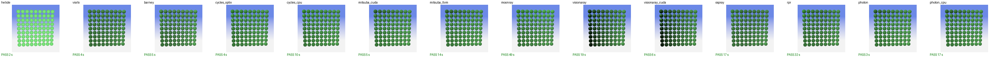

**sample06**

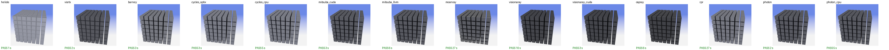

**sample07**

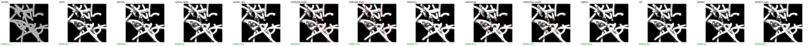

**sampler-image3d**

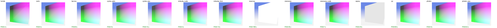

**sampler-image3d-borderColor**

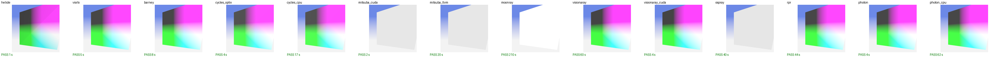

**unstructured-cellCentric**

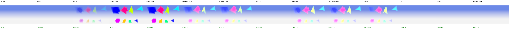

**unstructured-vertexCentric**

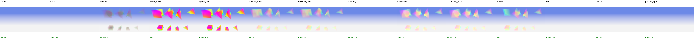

**viewer-sample01**

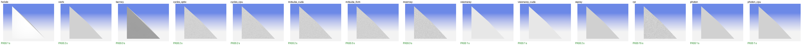

**viewer-sample02**

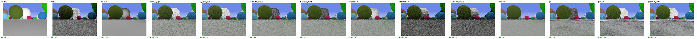

**viewer-sample05**

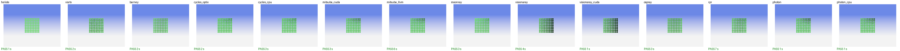

**viewer-sample07**

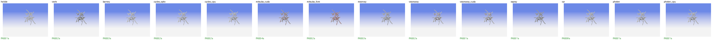

## 6. Remaining differences

The ANARI specification leaves some choices to the devices, and some devices lack
features. These differences remain:

* **Unsupported features.** These are skipped with a warning, and the tile shows only the
  background or a white surface:
  * helide (the minimal reference device): `hdri` light, isosurface, `unstructured` field.
  * VisRTX: `unstructured` field.
  * MoonRay: isosurface, `image3D` sampler, `unstructured` field.
  * Mitsuba: `image3D` sampler.
  * OSPRay: `image3D` sampler.
  * Radeon ProRender: `unstructured` field.
  * Photon: `unstructured` field.
* **Ambient light together with an hdri** (`reference-hdri`, `geometry-triangles-testorb-np`,
  which set `ambientRadiance = 1`):
  * barney, Cycles, Mitsuba and MoonRay let the hdri replace the ambient light.
  * VisRTX and OSPRay add both, as the specification describes two independent lights, so
    the mirror sphere saturates to white.
* **Visionaray** is an experimental device (its own README calls it a playground).
  * The ambient light only lights diffuse surfaces: metals and glass lit by it alone are
    dark (`sample02`, `sample04`, `sample05`).
  * `curve` segments are cones with flat ends, not rounded at the joints (`sample07`).
* **Tessellated primitives.** Photon only traces triangles and Radeon ProRender has no
  cylinders, cones or curves: these are tessellated. With a million spheres
  (`geometry-spheres-with-sampler1D`), Photon uses octahedra with smooth normals, and
  Radeon ProRender instances of one sphere mesh, which makes it the slowest device on
  that sample.
* **Thin-walled glass in OSPRay.** `transmission` without a `thickness` is thin-walled in
  the ANARI specification. OSPRay renders it that way, without refraction (`sample02`);
  the other devices render solid glass.
* **VisRTX `default` renderer.** It is the `interactive` renderer: volumes are emissive and
  absorbing but not lit (as in the specification's reference algorithm), and reflections
  are limited. The `quality` renderer is the path tracer.
* **`transferFunction1D` opacity.** The specification defines the extinction as
  `-ln(1 - opacity) / unitDistance`; VisRTX, helide and Cycles follow it, while barney,
  Mitsuba, MoonRay, OSPRay and the Visionaray path tracer use the linear
  `opacity / unitDistance`.
  * With opacities close to 1 (`sample03`, `unstructured-*`), the spec-following devices
    render denser volumes.
  * The unstructured samples also show different colors in barney: its value-to-color
    mapping differs.
* **`sample06`** sets `radiance` on a directional light. That parameter belongs to area
  lights, so devices that only know `irradiance` render it darker.
* **`sampler-image3d-borderColor`** sets its wrap modes after `commitParameters()`, so they
  never apply; clampToEdge is the correct result.
* **Rough glass** (the large center sphere in `sample02`, roughness 1) is darker in Mitsuba,
  whose microfacet model does not compensate energy loss at high roughness.
* **Speed.** MoonRay renders on the CPU and is the slowest. `sample03` asks for 1024
  samples per pixel whenever a CUDA GPU exists: about 5 minutes with Mitsuba's
  `llvm_ad_rgb` and 12 minutes with MoonRay.

## 7. Device bugs found with the samples

The samples (and a white-furnace check) exposed these bugs. They are fixed locally in the
device repositories, and none of it is committed.

**cyclesphi-anari**
* A material committed without parameters was never finalized, so the surface was
  invisible (`sample01`).
* Meshes without normals were smooth shaded. The averaged normals cancel at vertices shared
  by oppositely wound triangles, so one triangle rendered black (`sample01_with_texture`).
* `transferFunction1D` opacity now follows the specification (`sample03`).
* Coarse isosurfaces were faceted.
* New features: `image3D` sampler and `unstructured` fields.

**VisRTX**
* A world with an invalid volume (an unsupported field) aborted the process with
  `cudaErrorInvalidDevice` (`unstructured-*`).
  * Cause: an empty grid launched a CUDA kernel with no threads, and the pending error
    surfaced in an unrelated call.
* The interactive renderer's ray-marching step could skip small volumes entirely
  (`sample03`).
* The quality renderer ignored ambient light in reflections.

**barney**
* The ambient light was counted several times: its radiance already contained 1/pdf, the
  pdf was applied again, and the MIS weights used a different pdf.
  * It showed as a white floor in `sample02`.
  * In the white-furnace test barney gave 1.29 instead of 0.50; it now gives 0.501.

**Mitsuba**
* An unsupported sampler failed the whole frame. `image1D` is now implemented, and
  `image3D` warns.
* An hdri together with ambient light failed ("Only one environment emitter").
* `specular = 0` produced NaNs in `scalar_rgb` (`sample04`/`05`/`06`), so those runs timed
  out.
* `llvm_ad_rgb` was unusable (LLVM-C.dll missing) and then crashed at exit.
* A volume with its opacity in the color alpha rendered nothing (`sample03`).
* PBR `opacity` was applied with the `opaque` alpha mode (`sample07`).
* New features: cylinders, cones, isosurfaces, `unstructured` fields, colors from vertex
  attributes, image background, depth of field.

**MoonRay**
* Unsupported subtypes did not warn.
* An image background rendered black.
* A volume with its opacity in the color alpha rendered as an opaque black block.
* Ambient light was added on top of the hdri, so the mirror sphere in `reference-hdri`
  rendered white.
* Missing normals gave a black triangle, and nearest texture filtering was blurred.
* Clear glass (`transmission`) rendered as an opaque white surface.
* New features: depth of field, curves rendered round, cylinders, cones, `image1D`.
  Default sampling is about twice as fast.

**helide / ANARI SDK (helium)**
* `Array::valueAtLinear` read one element past the end of an array at coordinate 1.0. This
  gave NaN pixels in volumes whose maximum value equals the end of `valueRange`.

**barney** (after the merge with the upstream `master`)
* `sample06` now asks for the device subtype `mpi`. A barney build without MPI threw an
  exception through the ANARI C API for it, which terminated Python. It now warns and
  creates the default device.

**anari-visionaray**
* A material committed without parameters was never finalized, and rendering it crashed
  with an access violation (`sample01`, `viewer-sample01`).
* CPU device: rendering an incomplete frame left the rendering semaphore locked, so the
  next call blocked forever (`testing-release_04` timed out).
* `isosurface` only accepted an array of isovalues, not the single `FLOAT32` of
  `sample03-isosurface`.
* Volumes (`sample03`): the transfer function and the `structuredRegular` field were
  sampled half a texel off, and the acceleration grid of the CPU device skipped parts of
  coarse volumes.
* CPU device: `unstructured` fields rendered empty (`unstructured-*`).
* Cones and cylinders with an index array read it from host memory on the CUDA device.
* New feature: `curve` geometry (`sample04`, `sample07`); the device advertised the
  extension without implementing it. Light units were fixed too, see the Blender ANARI
  documentation.

**anari-ospray**
* anari-ospray relies on the Principled parameter `specularMetallic` of the unreleased
  OSPRay 3.3. With OSPRay 3.2, materials with `specular = 0` lost their metallic and
  transmissive lobes: the metals and the glass of `sample02`, `sample04`, `sample05` and
  `reference-hdri` rendered black.
* The default infinite `attenuationDistance` turned thin-walled glass black.
* `unitDistance` of `transferFunction1D` was ignored (`sample03` rendered a faint volume).
* A visible hdri and the renderer background were added up.

**RadeonProRenderANARI**
* The device was written in 2022 for a pre-1.0 ANARI SDK and did not build any more. It
  was ported to ANARI SDK 0.17 (on helium) and RadeonProRender SDK 3.1.7.1; the Blender
  ANARI documentation lists what the port covers.

**Photon**
* Its ANARI layer was a stub, and it had not been built as a device on Windows. The device
  was rewritten on helium, and the path tracer's light transport was fixed (emissive and
  environment hits were counted twice). The Blender ANARI documentation has the details.
